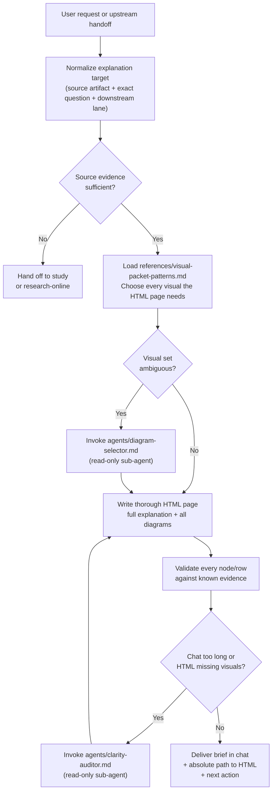

# explain
Translates an existing plan, study, spec cluster, decision packet, architecture path, or code flow into two surfaces: a **brief explanation in chat**, and a **thorough minimal HTML page** with every diagram and representation needed to fully understand the subject. It is a translation and presentation layer, not a research or planning workflow.

## Install

The fastest cross-agent install path is the `skills` CLI:

```bash
npx skills add gg-skills/explain
```

Drop this skill into a workspace as a Git submodule for pinned versions, or as a plain clone for latest `main`:

```bash
# Project-local, version-pinned:
git submodule add git@github.com:gg-skills/explain.git .claude/skills/explain

# OR project-local, latest main:
mkdir -p .claude/skills
git -C .claude/skills clone git@github.com:gg-skills/explain.git

# OR user-level, available in every project on this machine:
mkdir -p ~/.claude/skills
git -C ~/.claude/skills clone git@github.com:gg-skills/explain.git
```

Restart your agent or reload skills after installation. See the parent [`skills` catalog repo](https://github.com/gg-skills/skills) for the full catalog.

## When to use

Triggers from `SKILL.md`:

- The user explicitly asks to explain, summarize visually, make something easier to understand, or show the flow.
- A plan, study, spec set, decision packet, or code path already exists but is too dense for fast comprehension.
- Another workflow wants to offer a digestible explanation packet before planning or decision resolution.
- The task is about translating known local evidence, not collecting new evidence.

Skip when no explanation target or source artifact is available, when the request requires new evidence or new planning, or when the source material is too contradictory or incomplete to explain honestly.

## How it operates

### Inputs

| Input | Details |
|-------|---------|
| Source artifact | Any existing local artifact: plan file, study document, spec cluster, decision packet, runbook, code path, or explicit question with context supplied in the conversation. No remote fetching. |
| Explanation target | The exact question or concept to be explained, scoped by the user. |
| `references/visual-packet-patterns.md` | Read during step 2 to choose the visuals the HTML page needs. |
| `agents/diagram-selector.md` | Read-only sub-agent prompt, invoked when more than one visual form is plausible. |
| `agents/clarity-auditor.md` | Read-only sub-agent prompt, invoked when the draft brief or HTML needs a second-opinion pass. |
| Environment | No environment variables required. No network calls. No authentication. |

### Outputs

| Output | Format | Notes |
|--------|--------|-------|
| Chat brief | 2–5 sentences | Answer-first. No thorough dump. Ends with the HTML path and next action. |
| Thorough HTML page | `.tmp/explain/YYYY-MM-DD-{subject}/explain.html` | Minimal standalone HTML with full explanation plus all diagrams/tables/other representations needed to fully understand. |
| Absolute path | Filesystem path | Reported in chat so the user can open the thorough page. |
| Handoff context | Short bullets | Passed to `plan`, `decisions`, `study`, or `chooseable-options` when a next action is clear. |

### External commands

| Command | When used |
|---------|-----------|
| `npx tsx .agents/skills/explain/scripts/check-explanation-completeness.ts --latest` | Optional: scores the latest HTML page against the 12-item checklist. |
| `npx tsx .agents/skills/explain/scripts/choose-visual-format.ts --question "..."` | Optional: recommend diagram types for the HTML page. |

### Side effects

Writes one HTML file under `.tmp/explain/YYYY-MM-DD-{subject}/explain.html`. Does not create branches, run background agents, or call external APIs. Opening the page loads mermaid.js from a CDN so diagrams render.

### Mode toggles

| Condition | Behavior |
|-----------|----------|
| `agents/diagram-selector.md` available | Invoke as a native Codex sub-agent to select the visuals the HTML page needs. |
| `agents/clarity-auditor.md` available | Invoke as a native Codex sub-agent after drafting to pressure-test chat brevity and HTML fidelity. |
| Source evidence is thin or contradictory | Stop and hand off to `study/SKILL.md` or `research-online/SKILL.md` rather than guessing. |

## Operational flow



## Layout

```
explain/
├── SKILL.md                          # Skill description, triggers, workflow, policy
├── README.md                         # This file
├── agents/
│   ├── clarity-auditor.md            # Sub-agent prompt: chat brevity and HTML fidelity
│   └── diagram-selector.md           # Sub-agent prompt: choose visuals the HTML page needs
├── assets/
│   ├── icon-large.png
│   ├── icon-large.svg
│   ├── icon-master.png
│   └── icon-small.svg
├── references/
│   └── visual-packet-patterns.md     # Visual-type chooser and file-inclusion heuristics
└── scripts/
    ├── check-explanation-completeness.ts
    └── choose-visual-format.ts
```

## Quick start

1. Point the skill at an existing artifact: paste file content, link a path, or describe the decision set.
2. State the explanation goal: "explain the auth flow", "make this spec scannable", "show how these components interact".
3. The skill replies with a 2–5 sentence brief, writes `.tmp/explain/YYYY-MM-DD-{subject}/explain.html`, and reports that file's absolute path.

Example invocation:

```
/explain Explain how the request pipeline in src/middleware/ works, starting from the inbound HTTP request.
```

## Resources

- `references/visual-packet-patterns.md` — visual-type selection table and file-inclusion heuristics.
- `agents/diagram-selector.md` — sub-agent for choosing the visuals the HTML page needs.
- `agents/clarity-auditor.md` — sub-agent for pressure-testing chat brevity and HTML fidelity.
- Cross-skill handoffs: `decisions/SKILL.md`, `study/SKILL.md`, `plan/SKILL.md`, `specs/SKILL.md`, `chooseable-options/SKILL.md`, `text-architecture`.

## Caveats

- **Translation only.** This skill does not perform research, collect new evidence, or make decisions. If the source artifact does not exist, invoke `study/SKILL.md` or `plan/SKILL.md` first.
- **Evidence-grounded.** Every visual node, table row, and file reference must map back to verified evidence. Do not cite repository paths that have not been confirmed.
- **Two surfaces.** Chat is the brief. The HTML page is the thorough version, with every diagram needed to fully understand. Always return the absolute path.
- **Minimal HTML.** One standalone file. Mermaid diagrams in `<pre class="mermaid">` plus mermaid.js. No app chrome.
- **Mermaid labels.** Quote multi-word labels (`A["My label"]`).
